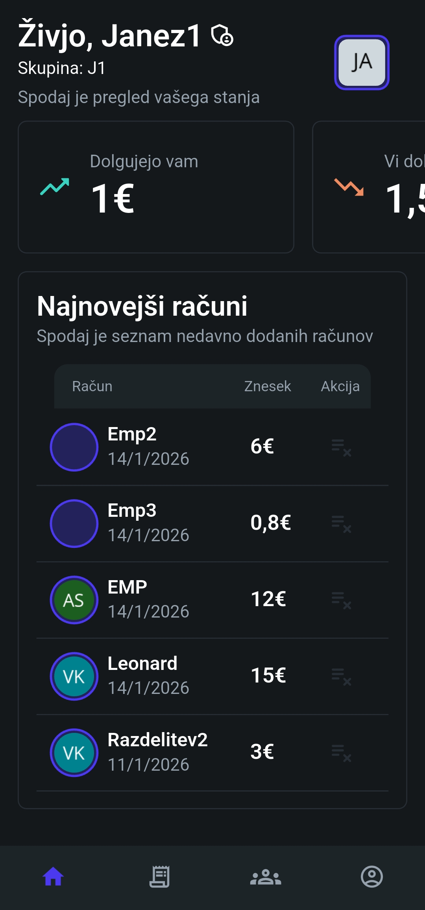
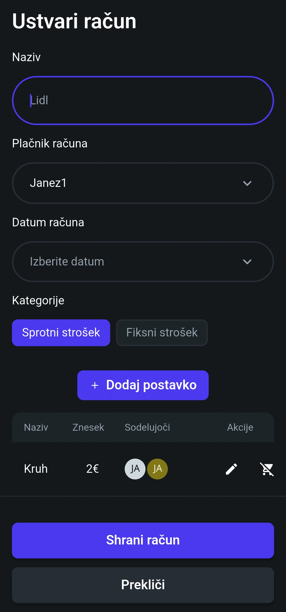
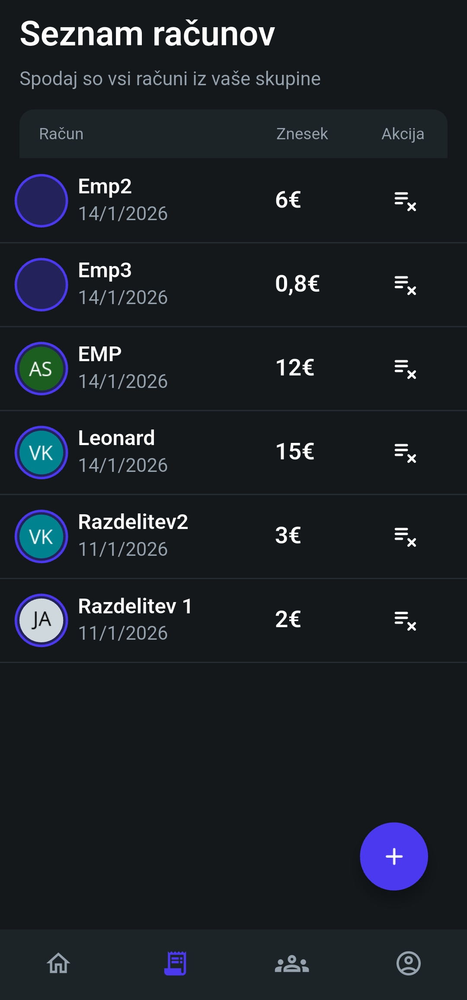
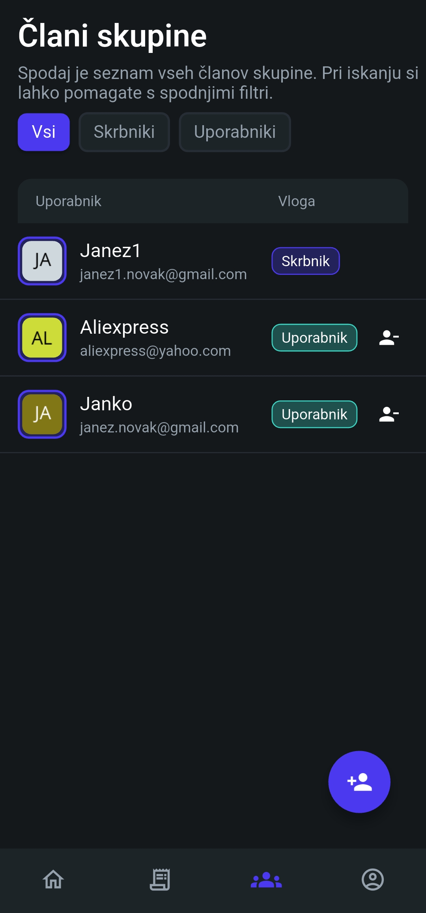

# Vini – Mobile Expense Splitting App

Vini is a mobile application for tracking shared expenses and splitting bills between multiple people.  
It is designed for small groups (friends, roommates, trips) and focuses on a simple and clear user experience.

The app uses an item-based approach to expense splitting, allowing users to assign each bill item to the people who participated in paying for it.

> ℹ️ The app UI is currently available in Slovenian.

## Features
- Create and manage shared bills
- Split expenses based on items
- Track balances (who owes whom)
- Manage users
- Simple and mobile-first UI

## Screenshots

## Tech Stack
- **Flutter** (generated with FlutterFlow)
- **Firebase Authentication**
- **Cloud Firestore**

## Installation (Android)

1. Download the latest release APK from GitHub:
   - https://github.com/Vipness/Vini/releases
2. Enable **Install unknown apps** in Android settings
3. Open the APK and install the app

## Notes
- This project was developed as part of a university assignment together with a friend who helped with the design.
